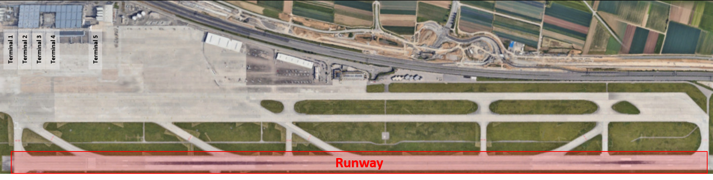
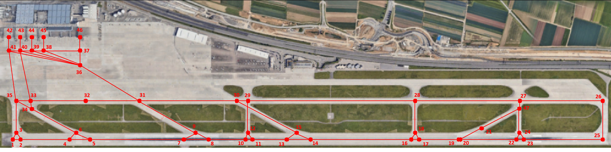
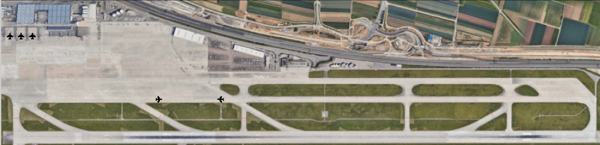
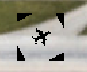

# Concurrent Airport Simulation

This project simulates the (airplane-) traffic on the Stuttgart airport. Stuttgart is a city in south Germany famous for the home of Mercedes and Porsche.

The airport consists of:
* runway - only one airplane is allowed to be on the runway either for landing or departuring
* 5 terminals 
* waiting queue for entering the runway.

Furthermore the airport has a navigation-mesh which is stored in json format (see resorces/graph.json). The navigation mesh consists of 47 Nodes. For pasrsing the json the thirdparty library nlohmann_json is used. Each node of the navigation mesh consists of:
* id
* x-coordinate
* y-coordinate
* neighbors
* type (WAYPOINT, TERMINAL, LANDINGPOINT, WAITINGPOINT, ENDPOINT)

 

Each airplane which is landing on the airport has its own path to get to its destination. The path is calculated with the **astar algorithm** (shortest path). Destinations of an airplane is the terminal after landing and the runway after the all passenger + luggage has left the airplane. When an airplane has been landed it's velocity reduces.

There are four different types of airplanes (Airbus A320, Airbus A380, Boing 777, Boing 747) on the aiport. Each of them has a individual number of passengers and braking distance when landing. Therefore their path to the terminal and back to the runway as well as their time for unloading passengers + luggage is unique.

The maximum amount of airplanes on the airport is set to 5 as there are only 5 terminals available. As soon as one airplane has left the airport and the runway is free, another airplane will land on the stuttgart airport. If the runway is not free - because of an other airplane which is landing or taking off - the new airplane will be shifted to the waiting queue. 

## Dependencies for Running Locally
* cmake >= 3.28
  * All OSes: [click here for installation instructions](https://cmake.org/install/)
* OpenCV >= 4.1
  * The OpenCV 4.1.0 source code can be found [here](https://github.com/opencv/opencv/tree/4.1.0)
* gcc/g++
  * Linux: gcc / g++ is installed by default on most Linux distros
  * Mac: same deal as make - [install Xcode command line tools](https://developer.apple.com/xcode/features/)
  * Windows: recommend using [MinGW](http://www.mingw.org/)

## Basic Build Instructions

1. Clone this repo.
2. Create a build directory on the top level directory: `mkdir build && cd build`
3. Compile: `cmake .. && make`
4. Run it: `./airport_simulation`. Note: maximize the window 
5. Stop the simulation press ctrl + C in the terminal

## Improvements / Open Points

[ ] Displaying the airplane on the airport when rotation angle is not 90/180/270/360 degrees. 
  
  

[ ] If the runway is blocked, the waiting airplanes stop at the same point, which gives the impression as they are crashing. Implement a functionality, that the airplanes keep a certain distance to each other when waiting until entry to the runway is granted.  
