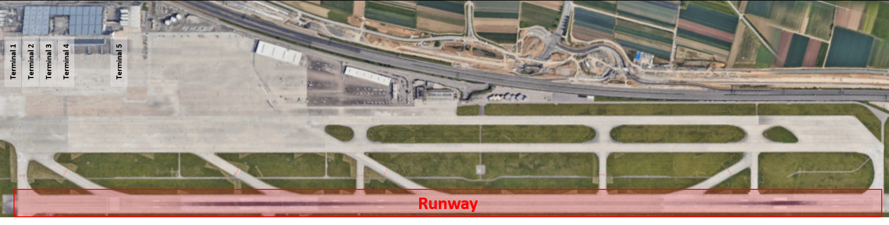

# Concurrent Airport Simulation

This project simulates the (airplane-) traffic on the Stuttgart airport. Stuttgart is a city in south Germany famous for the home of Mercedes and Porsche.

The airport consists of:
* runway - only one airplane is allowed to be on the runway either for landing or departuring
* 5 terminals 
* waiting queue for entering the runway.



Furthermore the airport has a navigation-mesh which is stored in json format (see resorces/graph.json). The navigation mesh consists of 47 Nodes. For pasrsing the json the thirdparty library nlohmann_json is used. Each node of the navigation mesh consists of:
* id
* x-coordinate
* y-coordinate
* neighbors
* type (WAYPOINT, TERMINAL, LANDINGPOINT, WAITINGPOINT, ENDPOINT)

 

Each airplane which is landing on the airport has its own path to get to its destination. The path is calculated with the **astar algorithm** (shortest path). Destinations of an airplane is the terminal after landing and the runway after the all passenger + luggage has left the airplane. When an airplane has been landed it's velocity reduces.

There are four different types of airplanes (Airbus A320, Airbus A380, Boing 777, Boing 747) on the aiport. Each of them has a individual number of passengers and braking distance when landing. Therefore their path to the terminal and back to the runway as well as their time for unloading passengers + luggage is unique.


The maximum amount of airplanes on the airport is set to 5 as there are only 5 terminals available. As soon as one airplane has left the airport and the runway is free, another airplane will land on the stuttgart airport. If the runway is not free - because of an other airplane which is landing or taking off - the new airplane will be shifted to the waiting queue. 


## Dependencies for Running Locally (Compiling)
* cmake >= 3.28
  * All OSes: [click here for installation instructions](https://cmake.org/install/)
* OpenCV >= 4.1
  * The OpenCV 4.1.0 source code can be found [here](https://github.com/opencv/opencv/tree/4.1.0)
* gcc/g++
  * Linux: gcc / g++ is installed by default on most Linux distros
  * Mac: same deal as make - [install Xcode command line tools](https://developer.apple.com/xcode/features/)
  * Windows: recommend using [MinGW](http://www.mingw.org/)

## Basic Build Instructions

1. Clone this repo.
2. Create a build directory on the top level directory: `mkdir build && cd build`
3. Compile: `cmake .. && make`
4. Run it: `./airport_simulation`. Note: maximize the window 
5. Stop the simulation press ctrl + C in the terminal

## Rubric Points

### Loops, Functions, I/O

* Rubric Point 1/4: The project demonstrates an understanding of C++ functions and control structures.
  * airplane.cpp at line 154 
  * ``` Airplane::move() ```
  * This funtion meets this criteria
* Rubric Point 2/4: The project reads data from a file and process the data, or the program writes data to a file.
  * graph.cpp at line 130
  * ``` NavigationMesh::parseJson() ```
  * This funtion meests this criteria
* Rubric Point 4/4: The project uses data structures and immutable variables.
  * graph.hpp at line 69
  * ``` vector<Node> _navigationMesh ```
  * This variable is a vector of type Node and meets this criteria

### Object Oriented Programming

* Rubric Point 1/6: One or more classes are added to the project with appropriate access specifiers for class members.
  * graph.hpp with class Edge (line 13), class Node (line 31) and class NavigationMesh (line 66)
* Rubric Point 2/6: Class constructors utilize member initialization lists.
  * graph.hpp edge class constructor at line 21
  * contructor meets this criteria
* Rubric Point 3/6: Classes abstract implementation details from their interfaces.
  * airplane.hpp
  * see member variables and their discription from line 22 until 42  
  * in addition member function names are chosen to document their effects (line 46 to 64)

### Memory Management
* Rubric Point 1/6: The project makes use of references in function declarations.
  * astar.cpp at line 81 (``` AStar::ExpandNeighbors ```), line 67 (``` AStar::getNode ```) ....
  * Those two funtions meet this criteria 
* Rubric Point 5/6: The project uses move semantics to move data instead of copying it, where possible.
  * airplane.cpp at line 127
  * ``` _threads.emplace_back(thread(&Airplane::move, this)) ```
  * This functions meets the criteria
* Rubric Point 6/6: The project uses smart pointers instead of raw pointers.
  * the projec uses shared pointer e.g. airplane.hpp at line 28 ``` shared_ptr<Airport> _airport; ```

### Concurrency
* Rubric Point 1/4: The project uses multithreading.
  * airplane.cpp at line 127 
  * function ```Airplane::simulation() ``` starts a thread for each airplane 
  * This funtion meets this criteria
* Rubric Point 2/4: A promise and future is used in the project.
  * airport.cpp at line 86
  * function ``` Runway::addAirplaneToQueue() ``` uses the promise/future to control the entering of airplanes to the runway (only one airplane on the runway is allowed)
* Rubric Point 3/4: A mutex or lock is used in the project.
  * airport.cpp at line 9, line 68 and 73
  * funtions ``` WaitingAirplanes::getSize() ```, ``` Runway::setRunwayIsBlocked ``` and ``` Runway::isBlocked() ``` meet this criteria


## Improvements / Open Points

[ ] Displaying the airplane on the airport when rotation angle is not 90/180/270/360 degrees. 
  
  

[ ] If the runway is blocked, the waiting airplanes stop at the same point, which gives the impression as they are crashing. Implement a functionality, that the airplanes keep a certain distance to each other when waiting until entry to the runway is granted.  
